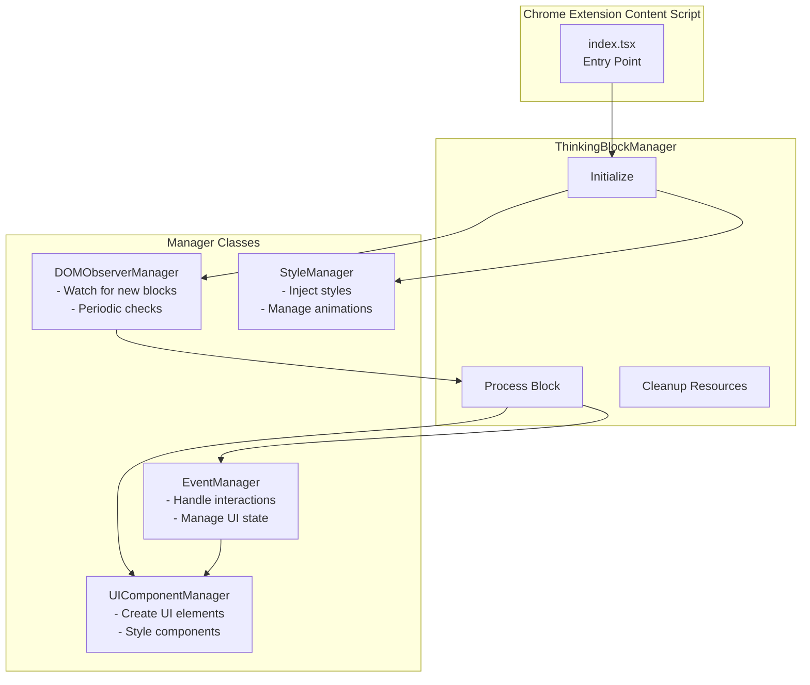
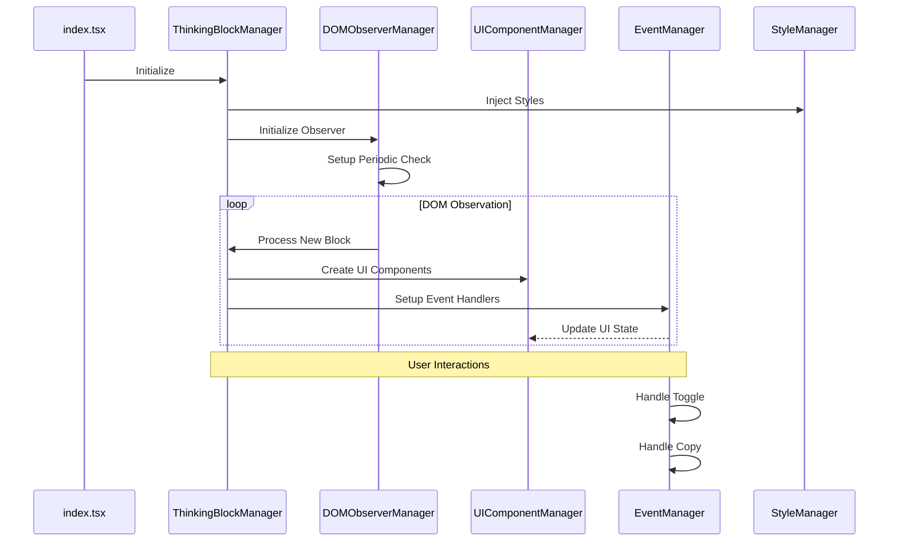
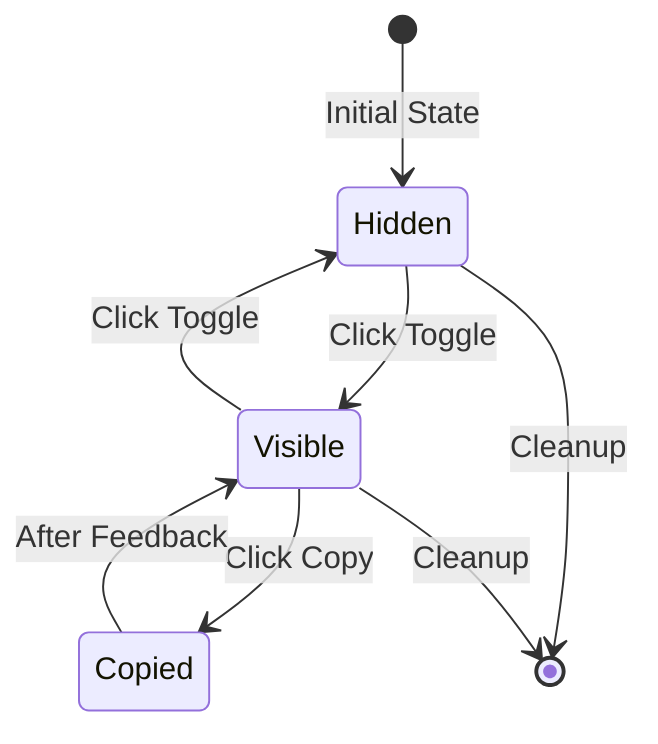

# Thinking Process Manager Architecture

This document outlines the architecture and workflow of the Thinking Process visualization feature in the Chrome extension.

## Architecture Overview

## Component Workflow

## Component Responsibilities

### ThinkingBlockManager

- Central coordinator for the thinking process feature
- Initializes and manages other components
- Processes new thinking blocks
- Handles cleanup on unload

### DOMObserverManager

- Observes DOM for new thinking blocks
- Performs periodic checks for missed blocks
- Manages retry mechanism for initialization
- Handles cleanup of observers

### UIComponentManager

- Creates UI elements (buttons, containers)
- Applies consistent styling
- Manages component hierarchy
- Handles component updates

### EventManager

- Sets up event listeners
- Manages UI state transitions
- Handles copy functionality
- Provides user feedback

### StyleManager

- Injects required styles
- Manages animation styles
- Ensures single style injection
- Handles style cleanup

## User Interaction Flow

## Installation and Usage

The Thinking Process Manager is automatically initialized when the Chrome extension loads. It requires no manual setup and begins observing for thinking process blocks immediately.

## Development

To modify or extend the functionality:

1. Each manager is designed to be independent and focused on a single responsibility
2. New features should be added to the appropriate manager
3. The ThinkingBlockManager coordinates all interactions between managers
4. Follow the established TypeScript types and interfaces

## Error Handling

- DOM observation includes retry mechanism
- Event handlers include error prevention
- Style injection prevents duplicates
- All cleanup is handled automatically
